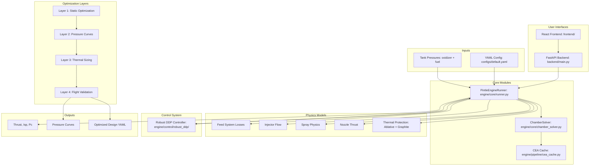

# Liquid Rocket Engine Design Pipeline

A comprehensive physics-based simulation and **multi-layer optimization pipeline** for liquid bipropellant rocket engines. The propellants and the injector type are **whatever you put in the config** — the whole point is to evaluate and compare different engine designs, not to model one fixed engine. Presets ship for **LOX/RP‑1** and **LOX/CH₄ (methalox)** with **pintle** or **impinging** injectors. Takes tank pressures as input and solves for chamber pressure, mass flow rates, thrust, and all performance parameters, accelerated by a native C physics kernel.

## Overview

**Core Principle:** Chamber pressure (Pc) is **never** an input — it's always **solved** from tank pressures by balancing supply and demand.

**Key Capabilities:**
- Full flow path simulation: tank → feed system → injector → combustion → nozzle → thrust
- **Injector modes:** pintle (`injector.type: pintle`) or twin-jet **impinging** (`injector.type: impinging`); see `docs/optimizer_readme.md` (Injector types) and `configs/canonical/impinging.yaml`
- **Propellants:** LOX/RP‑1 and **LOX/CH₄ (methalox)** via propellant presets; canonical seeds in `configs/canonical/`
- **Native C physics kernel** (`engine/native/`): the chamber solve + stability hot path runs in C, making `evaluate()` ~**88× faster** with machine‑precision parity — see [Native physics kernel](#native-c-physics-kernel-performance)
- Multi-layer optimization for complete engine design (geometry, pressure curves, thermal protection)
- Time-varying analysis with ablative recession tracking
- Stability analysis (chugging, acoustic, feed-system coupling)
- Flight simulation validation via RocketPy integration

## Native C physics kernel (performance)

The evaluation hot path — chamber‑pressure solve (injector → CEA → combustion
efficiency → ablative cooling → Brent root‑find) plus the chug/acoustic stability
sweep — is implemented as a standalone **C11 library under `engine/native/`** and
wired into the live path. It is an **opt‑in accelerator with automatic Python
fallback**, not a rewrite: the Python physics remains the reference implementation
and is used whenever native is disabled or a config isn't covered.

- **Enable:** the FastAPI backend sets `ED_USE_NATIVE=1` automatically at startup
  (and prebuilds the library), so the **frontend optimizer uses it out of the box**.
  For CLI/scripts, `export ED_USE_NATIVE=1`. Set `ED_USE_NATIVE=0` for pure Python.
- **Auto‑build:** on first use the library is compiled with CMake into an
  arch‑tagged directory — no manual build step. Requires a C compiler + CMake.
- **Parity & safety:** a one‑time self‑check compares the native result against
  Python and falls back on any mismatch. Measured agreement: chamber Pc ~5e‑10,
  CEA/stability ~1e‑16. A full `runner.evaluate()` matches Python to ~5e‑10.
- **Speed:** chamber solve ~400× faster; full `evaluate()` ~88× (≈68 ms → ≈0.8 ms),
  which is what makes the 15000‑eval Layer‑1 optimizer runs finish in seconds.
- **Coverage today:** impinging injector + ablative cooling + advanced efficiency.
  Pintle/coaxial, film/regen‑coupled cooling, and the nozzle/thrust step still run
  in Python (the native path falls back automatically for those).

See `engine/native/README.md` for build details, the staged port plan, and the
parity/benchmark methodology.

## Architecture



## Multi-Layer Optimization Pipeline

The optimizer in `engine/optimizer/` runs 4 layers sequentially:

| Layer | Name | Purpose | Key File |
|-------|------|---------|----------|
| 1 | Static Optimization | Geometry + initial pressure curves, static hot-fire validation | `layers/layer1_static_optimization.py` |
| 2 | Pressure Curves | Time-series pressure curve optimization | `layers/layer2_pressure.py` |
| 3 | Thermal Sizing | Final ablative/graphite thickness optimization | `layers/layer3_thermal_protection.py` |
| 4 | Flight Validation | RocketPy trajectory simulation, tank fill iteration | `layers/layer4_flight_simulation.py` |

### Entry Point

The main orchestrator is `run_full_engine_optimization_with_flight_sim()` in:
```
engine/optimizer/main_optimizer.py
```

## Directory Structure

```
EngineDesign/
├── engine/                      # Main engine package
│   ├── core/                    # Core physics models
│   │   ├── runner.py            # Main pipeline orchestrator
│   │   ├── chamber_solver.py    # Pc solver (supply = demand)
│   │   ├── chamber_geometry.py  # Chamber sizing calculations
│   │   ├── nozzle.py            # Thrust calculation
│   │   ├── spray.py             # Spray physics (J, SMD, Weber)
│   │   ├── discharge.py         # Dynamic Cd model
│   │   ├── geometry.py          # Injector geometry
│   │   └── injectors/           # Injector type implementations
│   │
│   ├── pipeline/                # Pipeline infrastructure
│   │   ├── config_schemas.py    # Pydantic validation
│   │   ├── config_switch.py     # Injector/propellant switching (see docs/CONFIG_SYSTEM.md)
│   │   ├── cea_cache.py         # CEA thermochemistry caching
│   │   ├── io.py                # Config loading/saving + preset resolution
│   │   ├── time_varying_solver.py
│   │   ├── tank_capacity.py     # Resolve max loadable propellant mass from config
│   │   ├── burn_time_sync.py    # Keep burn-time fields aligned across config sections
│   │   ├── flight_altitude_optimizer.py  # Min-fuel burn time for target apogee
│   │   ├── thermal/             # Thermal protection models
│   │   │   ├── ablative_cooling.py
│   │   │   ├── graphite_cooling.py
│   │   │   └── regen_cooling.py
│   │   └── stability/           # Stability analysis
│   │       ├── analysis.py
│   │       └── coupling.py
│   │
│   ├── native/                  # Native C physics kernel (opt-in accelerator)
│   │   ├── README.md            # Build, staged port plan, parity/benchmarks
│   │   ├── CMakeLists.txt       # C11 build (auto-built on first use)
│   │   ├── include/             # Public headers (ed_*.h)
│   │   ├── src/                 # C implementation (chamber, CEA, injector, ...)
│   │   ├── python/              # ctypes bindings + autobuild
│   │   └── tests/               # Golden-vector parity tests
│   │
│   ├── optimizer/               # Optimization layers
│   │   ├── main_optimizer.py    # Main orchestrator
│   │   ├── layers/              # Individual layer implementations
│   │   │   ├── layer1_static_optimization.py
│   │   │   ├── layer2_pressure.py
│   │   │   ├── layer3_thermal_protection.py
│   │   │   └── layer4_flight_simulation.py
│   │
│   └── control/                 # Control system
│       └── robust_ddp/          # Robust DDP controller
│           ├── controller.py    # Main controller
│           ├── ddp_solver.py    # DDP optimization
│           ├── dynamics.py      # System dynamics
│           └── constraints.py   # Safety constraints
│
├── backend/                     # FastAPI backend
│   ├── main.py                  # FastAPI application entry point
│   ├── state.py                 # Application state management
│   └── routers/                  # API route handlers
│       ├── config.py            # Configuration endpoints
│       ├── evaluate.py          # Engine evaluation endpoints
│       ├── timeseries.py        # Time-series analysis endpoints
│       ├── flight.py            # Flight simulation endpoints
│       ├── geometry.py          # Geometry endpoints
│       ├── optimizer.py         # Optimization endpoints
│       └── control.py           # Control system endpoints
│
├── frontend/                    # React + Vite frontend
│   ├── src/                     # React source code
│   ├── package.json             # Node.js dependencies
│   └── vite.config.ts           # Vite configuration
│
├── copv/                        # COPV pressure calculations
│   ├── copv_solve.py
│   ├── blowdown_solver.py       # Coupled blowdown simulation
│   └── n2_Z_lookup.csv
│
├── configs/                     # Configuration files
│   ├── default.yaml             # What the backend loads at startup
│   ├── canonical/               # Committed starting configs, one per injector
│   │   ├── pintle.yaml
│   │   └── impinging.yaml
│   └── propellants/             # Propellant presets (fluids + CEA identity)
│
├── output/                      # Generated files (gitignored)
│   ├── logs/                    # Optimization logs
│   ├── plots/                   # Generated plots
│   └── cache/                   # CEA cache files
│
├── docs/                        # Documentation
│   ├── layer_requirements.md    # Layer interface requirements
│   ├── optimizer_readme.md      # Optimizer architecture and usage
│   ├── CONFIG_SYSTEM.md         # Config model, presets, switching, burn-time sync
│   ├── flight_simulation.md     # /simulate, tank capacity, propellant regimes
│   ├── flight_altitude_optimization.md  # Min-fuel burn time for a target apogee
│   ├── control/                 # Control system documentation
│   │   ├── README.md
│   │   ├── INDEX.md
│   │   └── DDP_SOLVER.md
│   └── stability/               # Combustion stability physics
│
├── scripts/                     # Utility scripts
│   ├── simple_example.py
│   ├── run_full_pipeline.py
│   └── pressure_sweep.py
│
├── tests/                       # Test suite
│   └── control/                 # Control system tests
│
├── dev.sh                       # Development startup script
├── README.md
├── STARTUP_GUIDE.md             # Detailed startup instructions
├── TROUBLESHOOTING.md           # Common issues and fixes
├── requirements-base.txt        # shared deps (no rocketcea, no test tooling)
├── requirements.txt             # base + rocketcea (needs gfortran)
├── requirements-ci.txt          # base + pytest
└── .gitignore
```

## Quick Start

### Installation

**Python Backend:**
```bash
pip install -r requirements.txt        # everything, incl. rocketcea
pip install -r requirements-base.txt   # skip rocketcea (no gfortran needed)
```

`rocketcea` compiles NASA CEA from Fortran and ships as a 69 MB sdist. You
only need it to *regenerate* the CEA cache; everything else reads the
committed tables in `output/cache/`. CI and the API container use the base
list for exactly that reason.

**Frontend (Optional, for web UI):**
```bash
cd frontend
npm install
```

**Dependencies:** numpy, scipy, pandas, matplotlib, pydantic, PyYAML, rocketcea, rocketpy, plotly, ezdxf, cma, CoolProp, fastapi, uvicorn, python-multipart

**Frontend Dependencies:** Node.js and npm required. See `frontend/package.json` for React/Vite dependencies.

### Running the Application

**Recommended: Development Script**
```bash
./dev.sh                 # start (detached — survives closing the terminal)
./dev.sh --attach        # ...and watch it; Ctrl-B then D to detach again
./dev.sh --status        # up? which ports are listening?
./dev.sh --logs backend  # follow one process
./dev.sh --stop
```
Starts the FastAPI backend (http://localhost:8000) and the React frontend
(http://localhost:5173) in a detached tmux session, installing frontend
dependencies on first run. Because it stays running in the background, you can
ssh in later and `--attach` to debug. `--foreground` runs it in this terminal
instead; `./dev.sh --help` lists every flag. The same interface works in every
STAR project. Ports are overridable via `ENGINE_DESIGN_API_PORT` and
`ENGINE_DESIGN_UI_PORT`. See `STARTUP_GUIDE.md` for troubleshooting.

**Manual Startup (Alternative)**
If you prefer to start services manually:

Backend (FastAPI):
```bash
uvicorn backend.main:app --reload --port 8000
```

Frontend (React + Vite) - in a separate terminal:
```bash
cd frontend
npm install  # First time only
npm run dev
```

Then open http://localhost:5173 in your browser.

**Python API Only**
You can also use the engine directly via Python without the web interface (see Basic Usage below).

### Basic Usage

```python
from pathlib import Path
from engine.pipeline.io import load_config
from engine.core.runner import PintleEngineRunner

# Load configuration
config = load_config("configs/default.yaml")

# Initialize runner
runner = PintleEngineRunner(config)

# Evaluate at specific tank pressures
P_tank_O = 1305 * 6894.76  # psi to Pa
P_tank_F = 974 * 6894.76   # psi to Pa

results = runner.evaluate(P_tank_O, P_tank_F)

print(f"Thrust: {results['F']/1000:.2f} kN")
print(f"Chamber Pressure: {results['Pc']/6894.76:.1f} psi")
print(f"Mass Flow: {results['mdot_total']:.3f} kg/s")
print(f"Mixture Ratio: {results['MR']:.2f}")
```

### Web Application Features

The React frontend (started via `./dev.sh`) provides an interactive web interface with:

- Forward solver: Tank pressures → Performance
- Inverse solvers: Target thrust/O/F → Required tank pressures
- Full engine optimizer with multi-layer pipeline
- Time-series analysis and visualization
- Export optimized configurations
- Robust DDP control system integration
- Real-time performance monitoring

### Example Scripts

```bash
# Run full pipeline analysis
python scripts/run_full_pipeline.py

# Simple example
python scripts/simple_example.py

# Pressure sweep (2D grid)
python scripts/pressure_sweep.py
```

**For more detailed setup instructions, see:**
- `STARTUP_GUIDE.md` - Detailed startup instructions and troubleshooting
- `TROUBLESHOOTING.md` - Common issues and fixes

## Configuration

Engine parameters — including the propellants and the injector type — are
defined in YAML; pick whatever combination you want to evaluate. The block
below is just one example (the shipped `configs/default.yaml`); see `configs/`
for others (e.g. different propellants, pintle vs. impinging injectors). Key
sections:

```yaml
fluids:
  fuel: { name: Methane, density: 422.6, ... }
  oxidizer: { name: LOX, density: 1140.0, ... }

injector:
  type: impinging          # or "pintle"
  geometry:
    oxidizer: { n_elements: 20, d_jet: 0.002, impingement_angle: 50.0, ... }
    fuel: { n_elements: 20, d_jet: 0.002, impingement_angle: 60.0, ... }

feed_system:
  fuel: { K0: 2.0, ... }
  oxidizer: { K0: 2.0, ... }

combustion:
  cea: { ox_name: LOX, fuel_name: CH4, expansion_ratio: 6.14, ... }
  efficiency: { model: exponential, ... }
  # Lstar and A_throat live alongside the cea block in the combustion section

ablative_cooling:
  enabled: true
  initial_thickness: 0.008
  ...

graphite_insert:
  enabled: true
  initial_thickness: 0.006
  ...
```

## Key Features

### Robust DDP Control System

The project includes a robust Differential Dynamic Programming (DDP) controller for real-time engine control and optimization. Located in `engine/control/robust_ddp/`, this system provides:

- **Real-time control**: Optimal control trajectories for tank pressures
- **Safety constraints**: Hard constraints on chamber pressure, mixture ratio, and stability
- **Robustness**: Handles model uncertainty and disturbances
- **Feedforward + Feedback**: Combined control strategy for optimal performance

See `docs/control/` for detailed documentation on the control system architecture and usage.

### Backend API

The FastAPI backend (`backend/main.py`) provides RESTful endpoints for:

- Engine evaluation and performance analysis
- Time-series pressure curve generation
- Flight simulation integration
- Geometry optimization
- Control system integration
- Configuration management

API documentation available at http://localhost:8000/docs when the backend is running.

### Frontend Application

The React frontend (`frontend/`) provides an interactive web interface for:

- Real-time engine performance visualization
- Interactive parameter adjustment
- Optimization progress monitoring
- Results export and analysis
- Control system visualization

## Key Physics

### Chamber Solver
Root-finding: `supply(Pc) - demand(Pc) = 0`
- **Supply:** Mass flow from injectors (depends on P_tank - Pc)
- **Demand:** Mass flow required by combustion (depends on Pc, MR, c*)

### Discharge Coefficients
Dynamic model: `Cd(Re) = Cd_∞ - a_Re/√Re`

### Combustion Efficiency
L*-based: `η_c* = 1 - C × e^(-K×L*)`

### Nozzle Thrust
`F = ṁ × v_exit + (P_exit - P_ambient) × A_exit`

### Stability Analysis
- Chugging margin
- Acoustic modes
- Feed-system coupling
- Combined stability score (0-1)

## References

- Huzel & Huang: "Design of Liquid Propellant Rocket Engines"
- Sutton & Biblarz: "Rocket Propulsion Elements"
- Lefebvre: "Atomization and Sprays"

## Related Documentation

See the `docs/` folder for additional documentation:

**Core Documentation:**
- `docs/layer_requirements.md` - Layer interface requirements
- `docs/optimizer_readme.md` - Optimizer architecture, layers, and usage
- `docs/layer1_static_optimization_explained.md` - Layer 1 static optimization walkthrough
- `docs/Cd_calculation_methodology.md` - Discharge coefficient methodology
- `docs/pintle_geometry_constraints.md` - Pintle geometry constraints
- `docs/stability/combustion_stability_physics.md` - Combustion stability physics

**Config, Flight & Performance:**
- `docs/CONFIG_SYSTEM.md` - Config model: two canonical configs, propellant presets, in-memory switch, burn-time sync
- `docs/flight_simulation.md` - `/simulate` endpoint, tank-capacity resolution, and propellant regimes
- `docs/flight_altitude_optimization.md` - Minimum-fuel burn-time optimization for a target apogee
- `engine/native/README.md` - Native C physics kernel: build, staged port plan, and parity/benchmark methodology

**Control System Documentation:**
- `docs/control/README.md` - Control system overview
- `docs/control/INDEX.md` - Module-by-module documentation index
- `docs/control/DDP_SOLVER.md` - DDP solver implementation
- `docs/control/CONSTRAINTS.md` - Safety constraints
- `docs/control/ROBUSTNESS.md` - Robustness features

**Additional Guides:**
- `STARTUP_GUIDE.md` - Detailed startup and troubleshooting
- `TROUBLESHOOTING.md` - Common issues and fixes
