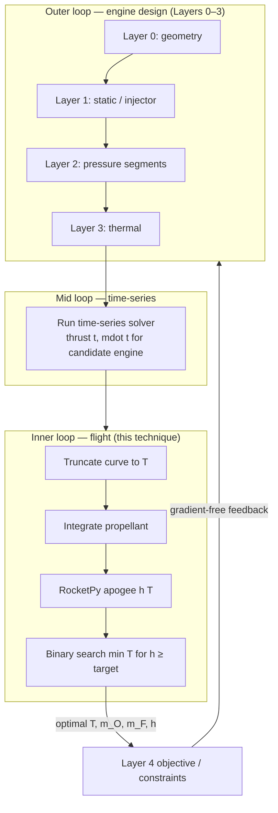

# Flight Altitude Optimization: Minimum-Fuel Burn Time

This document describes the technique used in the **Flight Simulation → Optimize for altitude** mode, why it is the right approach for a *fixed* engine time-series curve, and how the same idea can be lifted into the full engine design optimizer (Layers 0–4).

**Implementation:** `engine/pipeline/flight_altitude_optimizer.py`, API `POST /api/flight/optimize-altitude`, UI mode in `FlightSimulation.tsx`.

---

## Problem statement

Given:

- A **fixed** thrust and mass-flow history from time-series analysis (`thrust(t)`, `ṁ_O(t)`, `ṁ_F(t)`)
- Rocket mass, aerodynamics, and launch environment
- A **target apogee** (e.g. 3048 m)

Find:

1. **Optimal burn time** — the burn duration that reaches the target with the **least fuel**
2. **Required propellant** — LOX and fuel masses for that burn

The user can still use **Manual iteration** mode to explore off-optimal loads; this optimizer answers the constrained sizing question directly.

---

## Technique (three steps)

### 1. Truncate the time-series curve

For a candidate burn time `T`, slice the cached curve to `[0, T]`:

```
thrust_T(t), ṁ_O,T(t), ṁ_F,T(t)   for t ∈ [0, T]
```

The endpoint at `t = T` is **interpolated** so propellant integrals are consistent even when `T` falls between solver samples.

This is the key modeling choice: **burn time is not an independent knob** while the curve is fixed — it is *how much of the profile you fly*.

### 2. Load exact propellant for that burn (no dead weight)

For each truncated profile:

```
m_O(T) = ∫₀ᵀ ṁ_O(t) dt
m_F(T) = ∫₀ᵀ ṁ_F(t) dt
```

Flight simulation uses **exactly** these masses (subject to tank capacity caps). There is no excess propellant carried past what the truncated burn consumes.

This matters because excess propellant lowers apogee without extending burn — the manual iteration workflow already showed that loading above `∫ṁ dt` creates a plateau or drop in altitude.

### 3. Binary search on burn time

For each `T`, RocketPy returns apogee `h(T)`.

Search for the **shortest** `T` such that:

```
h(T) ≥ h_target − tolerance
```

Binary search on `T` needs ~15–25 flight sims instead of a 2D or 3D grid over `(T, m_O, m_F)`.

---

## Why this is the best approach *for a fixed curve*

| Property | Implication |
|----------|-------------|
| **Fuel mass increases with burn time** | `m_F(T) = ∫ṁ_F dt` is monotonic in `T` for any fixed curve. Minimizing fuel ⟺ minimizing feasible burn time. |
| **Exact loading removes a degree of freedom** | Without fixing `m(T) = ∫ṁ dt`, you must search `(T, m_O, m_F)` and fight dead-weight plateaus. |
| **Apogee is monotonic in burn time (typical case)** | With exact propellant and a fixed thrust profile, more burn ≈ more impulse ≈ higher apogee until physics limits apply. That makes binary search reliable. |
| **Full 6-DOF trajectory** | RocketPy captures drag, thrust misalignment, transient T/W, etc. Simpler `Δv ≈ √(2gh)` or constant-thrust estimates miss the actual apogee constraint. |
| **Computationally tractable** | One scalar search variable (`T`) with a cheap inner evaluation (one truncated integral + one flight sim). |

### What this mode deliberately does *not* do

It does **not** change injector geometry, chamber size, or tank pressures. Those are frozen in the time-series run. If the full curve cannot reach the target apogee even at maximum `T`, the optimizer reports **infeasible** and suggests re-running time-series with more thrust or a longer profile.

---

## Workflow in the app

```
Time-series (lock engine profile)
        ↓
Optimize for altitude (search T on that curve)
        ↓
Optional: Manual mode (tweak masses, inspect diagnostics)
```

Tank limits come from config (`propellant_tank_fill_factor`, `tank_volume_m3`, or explicit `*_tank_capacity_kg`). If required propellant at the optimal `T` exceeds a tank cap, truncation and warnings surface in diagnostics — same as manual mode.

---

## Extending to the full engine design optimizer

Today’s flight altitude optimizer is a **inner loop** for a fixed engine. The full STAR optimizer (Layers 0–4) chooses engine geometry and pressure histories. The natural extension is to nest this loop **inside** Layer 4 (or as a shared helper both Layer 4 and the Flight tab call).

### Current Layer 4 vs new technique

| | Layer 4 (today) | Flight altitude optimizer |
|--|-----------------|---------------------------|
| **Decision variables** | Tank fill masses (`m_O`, `m_F`) | Burn time `T` on fixed curve |
| **Burn profile** | Full time-series | Truncated time-series |
| **Objective** | Match target apogee by trimming propellant | Minimize fuel subject to apogee ≥ target |
| **Search** | Heuristic mass steps | Binary search on `T` |

Layer 4 assumes the **full** curve duration; the new method finds the **minimum portion** of that curve that satisfies altitude — strictly better for propellant sizing when you are allowed to shut down early.

### Proposed nested optimization architecture



### Concrete integration steps

1. **Extract a shared helper**  
   Move `optimize_minimum_fuel_burn_time()` behind an interface Layer 4 and `/api/flight/optimize-altitude` both call (partially done via `_execute_flight_simulation` in `backend/routers/flight.py`).

2. **Replace or augment Layer 4 tank-fill iteration**  
   In `engine/optimizer/layers/layer4_flight_simulation.py`, after generating pressure curves:
   - Call the altitude optimizer instead of (or before) bidirectional mass trimming.
   - Return `(T_opt, m_O_opt, m_F_opt, h_achieved)` as Layer 4 outputs.

3. **Use results as Layer 4 constraints for the outer loop**  
   For each engine candidate from Layers 1–3:
   - **Feasibility:** `success == true` and `h_achieved ≥ h_target`
   - **Objective terms:** minimize `m_F_opt`, `m_O_opt`, or total impulse at `T_opt`
   - **Derived requirements:** optimal `T_opt` feeds back into time-series duration bounds and COPV sizing

4. **Close the loop on burn time in Layer 2**  
   Layer 2 already optimizes pressure segments over a nominal burn window. Add:
   - Segment duration or shutdown time as an explicit variable
   - Time-series re-run whenever segments change
   - Inner altitude optimizer to score each candidate

5. **Multi-objective / Pareto extension**  
   Outer optimizer can trace:
   - Min fuel at fixed apogee (this technique)
   - Max apogee at fixed tank volume
   - Min engine dry mass vs min propellant

6. **Constraints beyond altitude**  
   The same inner loop can record max-Q, max acceleration, COPV margin at `T_opt`, and stability metrics from the time-series — rejecting engine candidates before expensive outer iterations complete.

### Why this scales better than optimizing everything at once

- **Separates time scales:** Engine geometry changes slowly; burn truncation is a fast post-process on a cached curve.
- **Avoids nonsensical mass loads:** Exact `∫ṁ dt` loading keeps the inner problem physical.
- **Reduces dimensionality:** Outer loop searches engine parameters; inner loop collapses `(T, m_O, m_F)` to one scalar `T`.
- **Reuses existing infrastructure:** Time-series solver + RocketPy + tank capacity logic already exist; this adds a search wrapper, not a new physics stack.

### Suggested Layer 4 objective (example)

For a candidate engine configuration `x`:

```
J(x) = w_f · m_F*(x) + w_o · m_O*(x) + w_d · m_dry(x)
```

subject to:

```
h*(x) ≥ h_target
COPV_margin*(x) ≥ margin_min
stability_score(x) ≥ score_min
```

where `(T*, m_O*, m_F*, h*) = optimize_minimum_fuel_burn_time(time_series(x), h_target)`.

If the inner problem is infeasible, assign a large penalty to `J(x)` so the outer optimizer pushes toward higher thrust or longer usable burn.

---

## Summary

- **Fixed curve:** optimal burn time = shortest truncation that hits apogee; optimal fuel = `∫ṁ_F dt` at that time.
- **Best method:** truncate → exact propellant → RocketPy → binary search on `T` (monotonic, no dead weight, few sims).
- **Next step for engine design:** run this inner loop on every Layer 1–3 candidate’s time-series and feed `(T_opt, m_O_opt, m_F_opt)` into Layer 4 objectives and constraints, closing the loop back to pressure-segment duration and geometry.

See also: `docs/optimization_layers_readme.md`, `engine/optimizer/layers/layer4_flight_simulation.py`.
