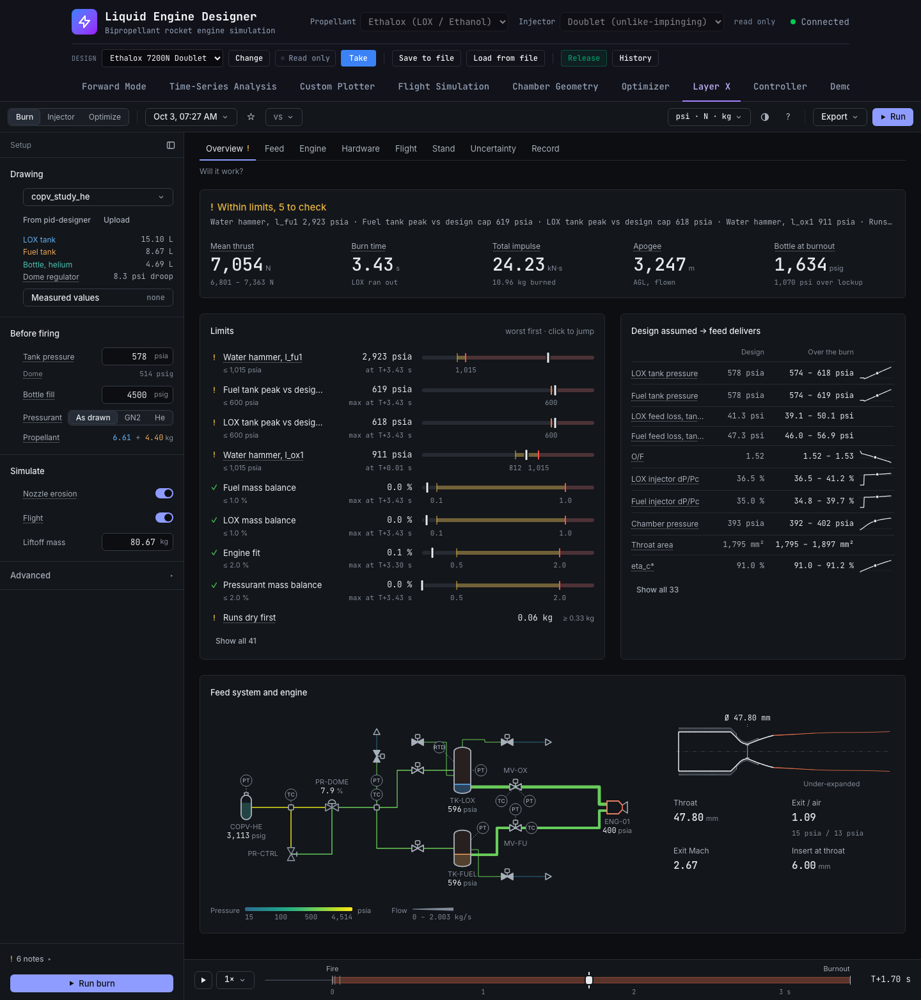

# Layer X walkthrough: load, run, and find the closest limit

This is for someone opening Layer X for the first time. By the end you will know which limit
the burn comes closest to, and when it gets there. The steps are also a test:
`frontend/e2e/layerx-walkthrough.spec.ts` follows them and clicks only controls a person can see
and read (see [Running the test](#running-the-test)).

Layer X fires the engine design you have open through a real feed-system drawing, in time. The
result is a burn that has not happened yet: what the stand gauges should read, what the chamber
sees, and how close each limit gets.

## 1. Load

1. Open the app (`./dev.sh`, then <http://localhost:5173>). The design bar at the top shows the
   design you have open. On a first visit that is your first design: **Ethalox 7200N Doublet** (LE4).
2. Click the **Layer X** tab.

You land on **Set up a burn**, a three-step guided start:

| step | what it shows | where to change it |
|---|---|---|
| 1 Pick the drawing | `copv_study_he`: the helium hot-fire stand | rail, **Drawing** |
| 2 Set tank pressure and bottle fill | the design's lockup (578 psia) and the drawing's bottle (4500 psig) | rail, **Before firing** |
| 3 Run | *ready*, or what blocks the run | rail foot |

Clicking a step lights up its control in the rail on the left. The rail holds the setup and
nothing else. **Advanced** (closed) holds the model switches, and each one is off unless you turn
it on.

The rail foot lists anything that blocks the run. For example, choose the nitrogen drawing
(`copv_study_gn2`) and a red **Nitrogen over LOX** block appears. It says why: nitrogen condenses
into LOX above about 52 psia at 90 K, and the model does not include that. It offers two ways out:
**Use helium**, or **Run anyway…**, which takes you to the acknowledgement under Advanced. Switch
back to `copv_study_he`.

## 2. Run

Click **Run burn**. It is under the guided steps and at the rail foot, and the shortcut is `R`.

The stage tracker shows **Settle → Pass n → Checks**. Each pass burns the engine, erodes the
nozzle, and flies the vehicle. Then the next pass burns again with the eroded throat and the
flight's acceleration, until the burn stops moving, usually after 4 passes. With flight on, the
LE4 run takes about 2–3 minutes.

When it finishes, the page tabs appear and Layer X opens on **Overview**, under the question
*"Will it work?"*

## 3. Which limit is closest, and when?

Overview answers it in two places.

- **The verdict strip** (top) gives one status line, e.g. **! Within limits, 5 to check**, and
  names the limits behind it. Below it are the five figures that matter: mean thrust, burn time,
  total impulse, apogee, and the bottle at burnout.
- **Limits** (left panel, *"worst first · click to jump"*) shows one margin bar per graded limit,
  sorted by how close each comes to its red line. **The first bar is the answer to "which".** Each
  bar has:
  - the value, against the limit written under it (e.g. `≤ 1,015 psia`);
  - when it was worst, at the right (e.g. `at T+3.43 s`);
  - a track: the red line, the amber band, and the value's marker.

  Hover a bar to see why the threshold is where it is. A limit from a check the team has not
  reviewed yet is graded amber at most, and its hover says so (and whether it would be red).

**Click the first bar to answer "when".** The time cursor jumps to that moment, and every number,
chart, the schematic and the engine section move to it. The timeline at the bottom reads the
same time (`T+3.43 s`). The schematic rings the part the limit belongs to: a tank, the bottle,
the engine, or (for water hammer) the main valve.

On the LE4 helium run of 2026-10-03 (`20261003-142724-740c86`), the closest limit was
**Water hammer, l_fu1**: 2,923 psia against the fuel tank's 1,015 psia rating, when the main
valve shuts at **T+3.43 s**. It is amber, not red, because water hammer is a new check whose
ratings are estimates. The next two limits are the tank peaks against the design's 600 psi cap,
also at burnout.

To go deeper:

- **Feed** shows where the pressure goes.
- **Engine** shows what the chamber sees.
- **Hardware** shows what the burn does to the engine.
- **Record** shows whether you can trust this run.

Every page follows the same cursor. Use `[` and `]` to step between events, Space to play, and
`?` to list the shortcuts.



## Running the test

The test burns once, for real, through the backend it is pointed at, so it adds one run to your
list. It runs only when asked:

```bash
cd frontend
LAYERX_WALKTHROUGH=1 PLAYWRIGHT_BASE_URL=http://localhost:5173 npx playwright test e2e/layerx-walkthrough.spec.ts
```

`playwright.config.ts` reuses servers it can reach at `127.0.0.1:8000` and `127.0.0.1:5173`. If
it cannot reach one, it starts it. `dev.sh`'s vite answers on `localhost` (`::1`) only, so there,
point Playwright at a config with no `webServer`, and it will never start a second stack. Save
the config outside the repo, and run with `NODE_PATH=$PWD/node_modules` so it finds
`@playwright/test`:

```ts
import { defineConfig, devices } from '@playwright/test';
export default defineConfig({
  testDir: '<repo>/EngineDesign/frontend/e2e',
  testMatch: /layerx-walkthrough\.spec\.ts/,
  workers: 1,
  use: { baseURL: process.env.PLAYWRIGHT_BASE_URL ?? 'http://localhost:5173' },
  projects: [{ name: 'chromium', use: { ...devices['Desktop Chrome'], viewport: { width: 1440, height: 900 } } }],
});
```

```bash
LAYERX_WALKTHROUGH=1 PLAYWRIGHT_BASE_URL=http://localhost:5173 NODE_PATH=$PWD/node_modules npx playwright test -c /path/to/walkthrough.config.ts
```

The test checks each step:

1. **Load.** The app connects; the **Layer X** tab opens on *Set up a burn* with the helium
   drawing.
2. **Run.** **Run burn** is enabled once the preflight passes; the stage tracker appears; the
   pages appear when the burn finishes, on Overview.
3. **Closest limit.** The first row of **Limits** is a named, clickable bar. Its name gives the
   limit, its value, its grade, its worst moment (`at T+…`) and the line it is graded against.
4. **When.** Clicking it moves the **Time cursor** slider to that moment (its `aria-valuetext`).
5. **No errors.** No page errors on the way.

## Older GUI

Layer X opened the rebuilt GUI by default from 2026-10-03. `?lx=1` opens the old one
(`components/layerx/`) for one more release; the code marks it `TODO(next release)`.
